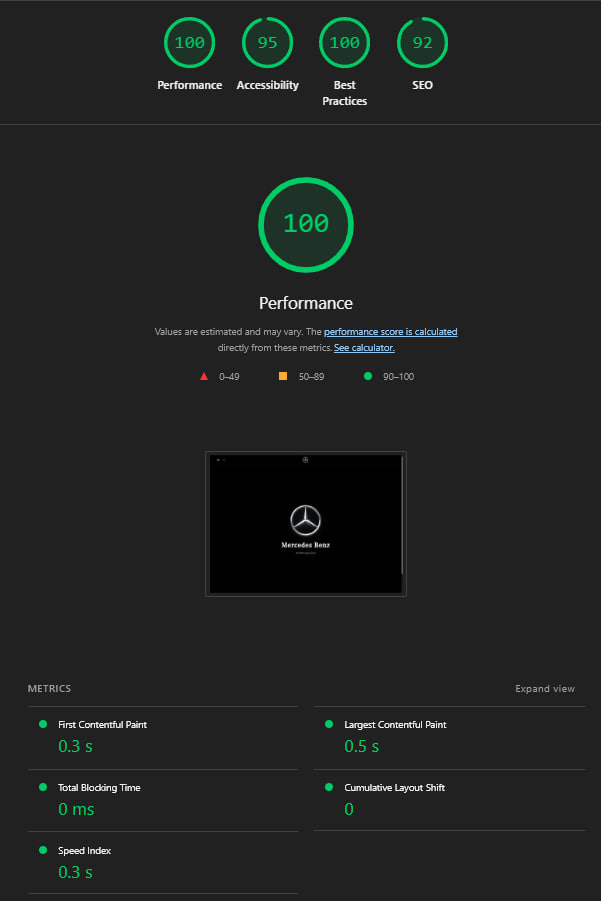
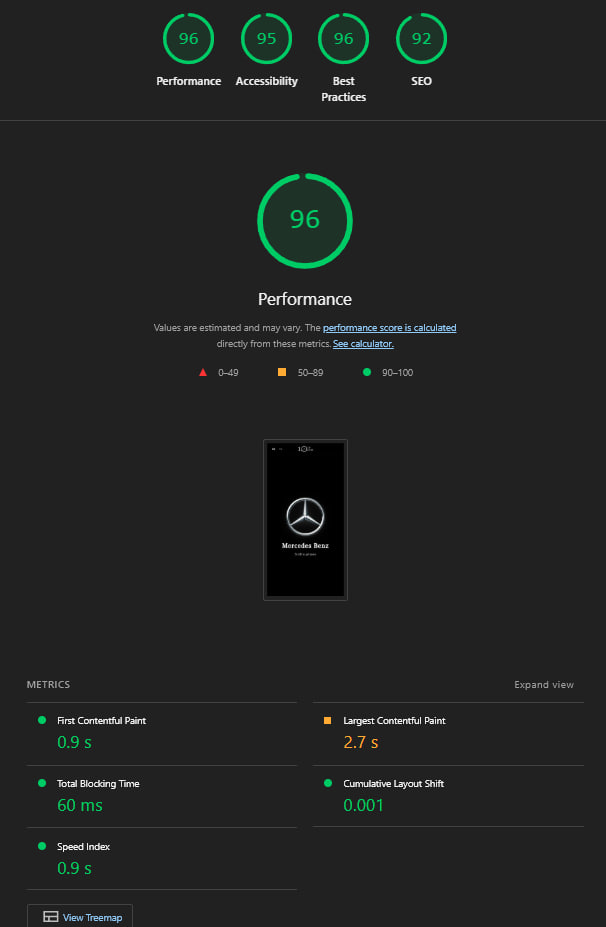
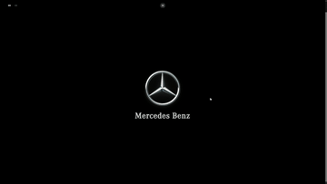

# Mercedes-Benz — Showcase Website

Pet-проект презентационного сайта автомобилей Mercedes-Benz с интерактивной 3D-моделью, каталогом, мультиязычностью и формой консультации.

---

## О проекте

Полноценное full-stack веб-приложение с интерактивной 3D-визуализацией автомобиля G63 AMG, двуязычным интерфейсом (EN / DE), каталогом моделей с фильтрацией и страницей детальной информации об автомобиле.

---

## Фичи

- **Интерактивная 3D-модель** - G63 AMG с вращением, анимациями и деталями на базе Three.js / React Three Fiber
- **Мультиязычность (EN / DE)** - i18n роутинг через Next.js App Router
- **Каталог с фильтрацией** - динамическая фильтрация по: текстовому поиску, типу кузова, типу топлива, трансмиссии, приводу, числу мест, диапазону мощности (л.с.), а также быстрые чипы AMG / EQ; состояние фильтров хранится в Zustand - сохраняется при навигации между страницами; виртуализация списка для плавной работы с большим числом позиций
- **Форма консультации** - валидация схем через Zod + React Hook Form; Zustand-стор отслеживает уже отправленные запросы и блокирует повторную отправку по тому же авто
- **Страница детали авто** - слайдер изображений, характеристики, CTA форма
- **SSR + динамические маршруты** - страницы каталога и деталей рендерятся на сервере, данные тянутся с NestJS API
- **REST API** - NestJS + TypeORM + PostgreSQL, миграции, сидер с тестовыми данными
- **Полный цикл деплоя** - Frontend на Vercel, Backend на Render, БД на Neon (serverless PostgreSQL), мониторинг через UptimeRobot

---

## Стек технологий

### Frontend
| Технология | Версия | Назначение |
|---|---|---|
| Next.js | 16 | App Router, SSR, i18n routing |
| React | 19 | UI |
| TypeScript | 5 | Типизация |
| SCSS Modules |  | Стили |
| Three.js | 0.182 | 3D движок |
| React Three Fiber | 9 | React-обёртка над Three.js |
| @react-three/drei | 10 | Хелперы для R3F |
| Zustand | 5 | State management |
| React Hook Form | 7 | Управление формами |
| Zod | 4 | Валидация схем |
| i18next + react-i18next | 25/16 | Локализация EN/DE |
| ky | 2 | HTTP-клиент |

### Backend
| Технология | Версия | Назначение |
|---|---|---|
| NestJS | 11 | REST API |
| TypeORM | 0.3 | ORM |
| PostgreSQL | 17 | База данных |
| class-validator | 0.15 | Валидация DTO |

### DevOps
| Сервис | Назначение |
|---|---|
| Docker + Docker Compose | Контейнеризация |
| Vercel | Хостинг фронтенда |
| Render | Хостинг бэкенда |
| Neon | Managed serverless PostgreSQL |
| UptimeRobot | Мониторинг uptime, keep-alive пинг |

---

## Запуск локально

### Требования
- Node.js 22+
- Docker + Docker Compose

### Вариант 1 — Docker (рекомендуется)

```bash
git clone https://github.com/Therealkosbruh/Next-project-mercedes-
cd Next-project-mercedes-

docker compose up -d --build
```

Сервисы:
- Frontend → http://localhost:3000
- Backend API → http://localhost:3001/api
- PostgreSQL → localhost:5432

Для первого запуска с тестовыми данными:
```bash
cd back
npm run seed
```

### Вариант 2 — локально без Docker

**Backend:**
```bash
cd back
cp .env.example .env   
npm install
npm run migration:run
npm run start:dev
```

**Frontend:**
```bash
cd front
echo "NEXT_PUBLIC_API_URL=http://localhost:3001/api" > .env.local
npm install
npm run dev
```

### Production preview (Lighthouse аудит)
```bash
cd front
npm run preview   # next build && next start
```

---

> **Деплой**
> - **Frontend** → [Vercel]
> - **Backend** → [Render]> - **База данных** → [Neon]PostgreSQL
> - **Мониторинг** → [UptimeRobot](https://uptimerobot.com) — пинг каждые 5 минут для предотвращения sleep на Render Free (нужен в связи с оссобенностями использования бесплатного сервиса, для хостинга back части)

---

## Оптимизация производительности

### Результаты Lighthouse

**Desktop



**Mobile



### Что было сделано

#### 3D модель (главная страница)
- **Отложенная загрузка Three.js** - `ModelParentWrapper` рендерится только после первого `wheel`/`touchstart` события. Lighthouse не скроллит → Three.js не грузится во время аудита → **TBT = 0 ms**
- **Prefetch во время idle** — `requestIdleCallback` загружает JS-чанк Three.js в фоне пока пользователь читает intro, без блокировки main thread
- **Fade-in вместо лоадера** - canvas появляется плавно (opacity 0→1 за 1s) вместо spinner-оверлея
- **Preload GLB** - `preload()` из `react-dom` добавляет `<link rel="preload">` в `<head>` для 3D-модели
- **Cache-Control: immutable** - GLB файл кешируется на 1 год

#### LCP (Largest Contentful Paint)
- Логотип на главной — plain `` с `fetchpriority="high"` и `decoding="sync"` вместо `next/Image` (SVG не оптимизируется Next.js)
- Server-side `preload()` для SVG логотипа в серверном компоненте `page.tsx`

---

## Демо

---

